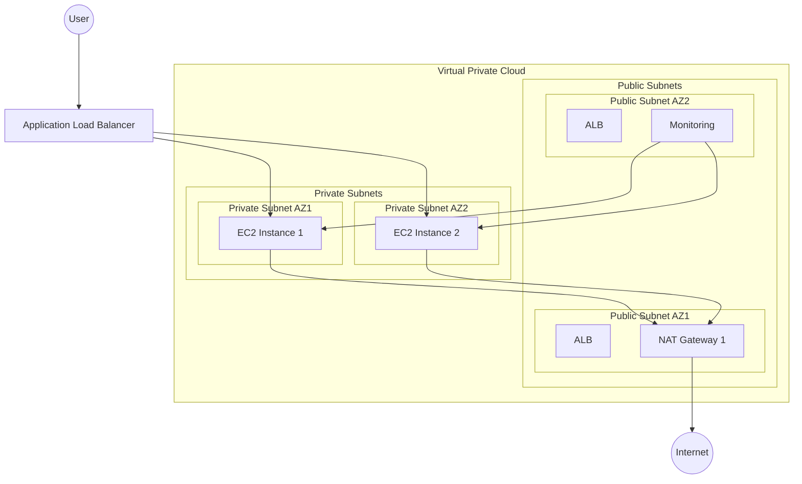

# AWS Infrastructure with Terraform

This repository contains Terraform configurations for deploying a scalable, highly available AWS infrastructure. The infrastructure includes VPC, Auto Scaling Groups, Application Load Balancer, and optional monitoring capabilities.

## Architecture Overview



## Infrastructure Components

### VPC Module
- Creates VPC with public and private subnets across multiple availability zones
- NAT Gateway for private subnet internet access
- Internet Gateway for public subnet access

### Auto Scaling Group (ASG) Module
- Launches Ubuntu 22.04 instances in private subnets
- Minimum 2 instances for high availability
- Configurable instance type and capacity
- Rolling updates with instance refresh
- Custom user data for automated setup

### Application Load Balancer (ALB) Module
- Deployed in public subnets
- HTTP/HTTPS support
- SSL certificate integration
- Health checks and target group configuration
- Routes traffic to EC2 instances in private subnets

### Security Group Module
- Controlled access to ALB and EC2 instances
- SSH access configuration
- Monitoring-specific rules

### IAM Module
- Instance profiles for EC2 instances
- Required AWS service permissions

### Monitoring Module (Optional)
- Prometheus-based monitoring stack
- Docker Compose deployment
- ASG instance monitoring
- Deployed in public subnet for external access

## Prerequisites

- AWS Account
- Terraform >= 1.0
- AWS CLI configured with appropriate credentials
- SSH key pair for EC2 instance access

## Usage

1. Clone the repository
2. Navigate to the desired environment directory (dev, dev2, or prod)
3. Initialize Terraform:
   ```bash
   terraform init
   ```
4. Review and update the terraform.tfvars file with your configuration
5. Deploy the infrastructure:
   ```bash
   terraform plan
   terraform apply
   ```

## Environment Configuration

The infrastructure supports multiple environments:

- `env/dev/` - Development environment
- `env/dev2/` - Secondary development/staging environment
- `env/prod/` - Production environment

Each environment can be configured independently through its respective `terraform.tfvars` file.

## Contributing

1. Fork the repository
2. Create your feature branch
3. Commit your changes
4. Push to the branch
5. Create a new Pull Request

## License

This project is licensed under the MIT License - see the LICENSE file for details.